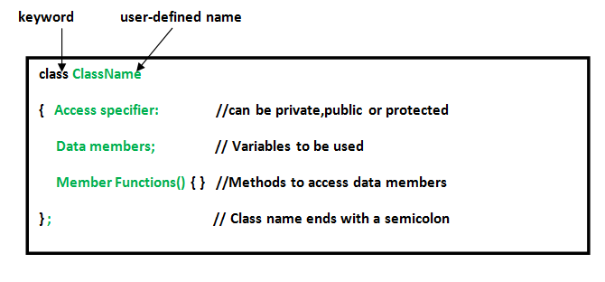
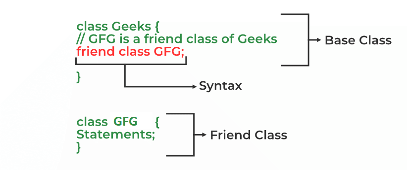

# Class   (User Defined Datatype)
In C++, class is a group of similar objects.
- A Class is a user-defined data type that has data members and member functions.
- Data members are the data variables and member functions are the functions used to manipulate these variables together,
these data members and member functions define the properties and behavior of the objects in a Class.
# Object
An Object is an instance of a Class. When a class is defined, no memory is allocated but when it is instantiated (i.e. an object is created) memory is allocated.

## Defining Class and Declaring Objects


## Reference to Dynamic Objects in C++
Syntax:
```
ClassName *ptr_obj;              // pointer to object
ptr_obj = new ClassName    // Dynamic object
```
Example
``` js
class Test
{
    // Data members
    int a, b;
    public:
        // Constructor to initialize
        // data members of class
        Test()
        {
            cout << "Constructor is called" << 
                     endl;
            a = 1;
            b = 2;
        };
        void show()
        {
            cout << "a = " << 
                     a << endl;
            cout << "b = " << 
                     b << endl;
        }
};
int main()
{
    Test *ptr;         
    ptr = new Test;  
    ptr->show();     
    return 0;
}
```
## Declaring Objects
When a class is defined, only the specification for the object is defined; no memory or storage is allocated. To use the data and access functions defined in the class, you need to create objects.

Syntax
``` js
ClassName ObjectName;
```
## Accessing data members and member functions
 The data members and member functions of the class can be accessed using the dot(‘.’) operator with the object.

## C++ this Pointer
this pointer in C++ stores the address of the class instance
``` js
class Test
{
private:
   int x;
public:
   void setX (int x)
   {
       this->x = x;
   }
   void print() { cout << "x = " << x << endl; }
};
  
int main()
{
   Test obj;
   obj.setX(20);
   obj.print();
   return 0;
}
```
## Access Specifiers
**Access Specifiers in a class are used to assign the accessibility to the class members, i.e., they set some restrictions on the class members so that they can’t be directly accessed by the outside functions.**
 ### Public

  All the class members declared under the public specifier will be available to everyone.

  The public members of a class can be accessed from anywhere in the program using the direct member access operator (.) with the object of that class.

### Private
The class members declared as private can be accessed only by the member functions inside the class.

They are not allowed to be accessed directly by any object or function outside the class

Only the member functions or the friend functions are allowed to access the private data members of the class. 

However, we can access the private data members of a class indirectly using the public member functions of the class. 

### Private
The protected access modifier is similar to the private access modifier in the sense that it can’t be accessed outside of its class unless with the help of a friend class. 

The difference is that the class members declared as Protected can be accessed by any subclass (derived class) of that class as well. 

### Note
```
The protected access modifier is similar to the private access modifier in the sense that it can’t be accessed outside of its class unless with the help of a friend class. The difference is that the class members declared as Protected can be accessed by any subclass (derived class) of that class as well. 
```
## Friend Class and Function in C++
A friend class can access private and protected members of other classes in which it is declared as a friend.
Syntax:

``` js
// C++ Program to demonstrate the
// functioning of a friend class

class GFG {
private:
    int private_variable;
protected:
    int protected_variable;
public:
    GFG() {
        private_variable = 10;
        protected_variable = 99;
    }
    // friend class declaration
    friend class F;
};
class F {
public:
    void display(GFG& t)
    {
        cout << "The value of Private Variable = "
             << t.private_variable << endl;
        cout << "The value of Protected Variable = "
             << t.protected_variable;
    }
};
int main()
{
    GFG g;
    F fri;
    fri.display(g);
    return 0;
}
```
## Member Function of Another Class as Friend Function
``` js
// C++ program to create a member function of another class
// as a friend function
class base; // forward definition needed
// another class in which function is declared
class anotherClass {
public:
    void memberFunction(base& obj);
};
// base class for which friend is declared
class base {
private:
    int private_variable;
protected:
    int protected_variable;
public:
    base()
    {
        private_variable = 10;
        protected_variable = 99;
    }
    // friend function declaration
    friend void anotherClass::memberFunction(base&);
};
// friend function definition
void anotherClass::memberFunction(base& obj)
{
    cout << "Private Variable: " << obj.private_variable
         << endl;
    cout << "Protected Variable: " << obj.protected_variable;
}
int main()
{
    base object1;
    anotherClass object2;
    object2.memberFunction(object1);
 
    return 0;
}
```
### Note
```
The order in which we define the friend function of another class is important and should be taken care of.
```
### A Function Friendly to Multiple Classes
``` js
// Forward declaration
class ABC;
class XYZ {
    int x;
public:
    void set_data(int a){
      x = a;
    }
    friend void max(XYZ, ABC);
};
class ABC {
    int y;
public:
    void set_data(int a) {
      y = a;
    }
    friend void max(XYZ, ABC);
};
 
void max(XYZ t1, ABC t2){
    if (t1.x > t2.y)
        cout << t1.x;
    else
        cout << t2.y;
}
int main()
{
    ABC _abc;
    XYZ _xyz;
    _xyz.set_data(20);
    _abc.set_data(35);
    // calling friend function
    max(_xyz, _abc);
    return 0;
}
```
 ## Member Functions in Classes
There are 2 ways to define a member function:

1. Inside class definition

2. Outside class definition

### To define a member function outside the class definition we have to use the scope resolution:: operator along with the class name and function name. 
``` js
class Geeks
{
    public:
    string geekname;
    int id;
    void printname();
    void printid()
    {
        cout <<"Geek id is: "<<id;
    }
};
void Geeks::printname()
{
    cout <<"Geekname is: "<<geekname; 
}
int main() { 
    Geeks obj1;
    obj1.geekname = "xyz";
    obj1.id=15;
    obj1.printname();
    cout << endl;
    obj1.printid();
    return 0;
}
```
## Constructors
 Constructor in C++ is a special method that is invoked automatically at the time of object creation. 

 1.  Constructor is a member function of a class, whose name is same as the class name.

2. Constructor do not return value, hence they do not have a return type.

3. create the object of the class.

    • Constructors can be overloaded.

    • Constructor can not be declared virtual.
``` js
Constructor can be defined inside the class declaration or outside the class declaration

a.    Syntax for defining the constructor within the class

        <class-name>(list-of-parameters)
        {
                  //constructor definition
        }

b.    Syntax for defining the constructor outside the class

        <class-name>: :<class-name>(list-of-parameters)
        {
                //constructor definition
        }
 
```
## A constructor is different from normal functions in following ways: 

1. Constructor has same name as the class itself
Default Constructors don’t have input argument however, Copy and Parameterized Constructors have input arguments
Constructors don’t have return type

2. A constructor is automatically called when an object is created.

3. It must be placed in public section of class.
If we do not specify a constructor, C++ compiler generates a default constructor for object (expects no parameters and has an empty body).


## Default constructor

Default constructor is the constructor which doesn’t take any argument. It has no parameters.
``` js
class construct {
public:
    int a, b;
    // Default Constructor
    construct()
    {
        a = 10;
        b = 20;
    }
};
int main()
{
    // Default constructor called automatically
    // when the object is created
    construct c;
    cout << "a: " << c.a << endl << "b: " << c.b;
    return 1;
}
```
### Note:
 ```
 Even if we do not define any constructor explicitly, the compiler will automatically provide a default constructor implicitly.
 ```
 ##  Parameterized Constructors
To create a parameterized constructor, simply add parameters to it the
### Uses of Parameterized constructor: 
It is used to initialize the various data elements of different objects with different values when they are created.

``` js

class Point {
private:
    int x, y;
 
public:
    // Parameterized Constructor
    Point(int x1, int y1)
    {
        x = x1;
        y = y1;
    }
 
    int getX() { return x; }
    int getY() { return y; }
};
 
int main()
{
    // Constructor called
    Point p1(10, 15);
    // Access values assigned by constructor
    cout << "p1.x = " << p1.getX()
         << ", p1.y = " << p1.getY();
 
    return 0;
}
```

It is used to overload constructors.
 ### Note
  when the parameterized constructor is defined and no default constructor is defined explicitly, the compiler will not implicitly call the default constructor 

## Copy constructor
constructor which creates an object by initializing it with an object of the same class, which has been created previously is known as a copy constructor.  
``` js
Sample(Sample &t)
{
    id=t.id;
}
```
``` js
class student
{
    int rno;
    char name[50];
    double fee;
    public:
    student(int no, char n[],double f)
    {
        rno=no;
        strcpy(name,n);
        fee=f;
    };
    student(student &t)  //copy constructor (member initialization)
    {
        rno=t.rno;
        strcpy(name,t.name);
         
    }
    void display()
    {
        cout<<endl<<rno<<"\t"<<name<<"\t"<<fee;
    };
    void disp()
    {
        cout<<endl<<rno<<"\t"<<name;
    }   
};
int main()
{
    student s(1001,"Manjeet",10000);
    s.display();
    student manjeet(s);   //copy constructor called
    manjeet.disp();
     
    return 0;
}
```
## What is a destructor?
Destructor is an instance member function that is invoked automatically whenever an object is going to be destroyed. Meaning, a destructor is the last function that is going to be called before an object is destroyed.

1. Destructor release memory space occupied by the objects created by the constructor.
2. Destructor neither requires any argument nor returns any value.
3. The destructor is only one way to destroy the object created by the constructor. Hence destructor can-not be overloaded.
4. Destructor has the same name as their class name preceded by a tilde (~) symbol.
5. In destructor, objects are destroyed in the reverse of an object creation.
6.

It cannot be declared static or const. 

The destructor does not have arguments.

It has no return type not even void.

### The syntax for defining the destructor within the class
```
~ <class-name>() {
    // some instructions
}
```
### The syntax for defining the destructor outside the class:
```
<class-name> :: ~<class-name>() {
    // some instructions
}
```

``` js
// C++ program to demonstrate the execution of constructor
// and destructor when multiple objects are created
 
#include <iostream>
using namespace std;
class Test {
public:
    // User-Defined Constructor
    Test() { cout << "\n Constructor executed"; }
 
    // User-Defined Destructor
    ~Test() { cout << "\n Destructor executed"; }
};
 
main()
{
    // Create multiple objects of the Test class
    Test t, t1, t2, t3;
    return 0;
}
```

## Constructor Overloading in C++

 We can have more than one constructor in a class with same name, as long as each has a different list of arguments.This concept is known as Constructor Overloading

1. Overloaded constructors essentially have the same name (exact name of the class) and different by number and type of arguments.

2. A constructor is called depending upon the number and type of arguments passed.

``` js
// C++ program to illustrate
// Constructor overloading
class construct
{
public:
    float area; 
    // Constructor with no parameters
    construct(){
        area = 0;
    }
    // Constructor with two parameters
    construct(int a, int b){
        area = a * b;
    } 
    void disp(){
        cout<< area<< endl;
    }
};
 
int main()
{
    // Constructor Overloading
    // with two different constructors
    // of class name
    construct o;
    construct o2( 10, 20);
     
    o.disp();
    o2.disp();
    return 1;
}
```
